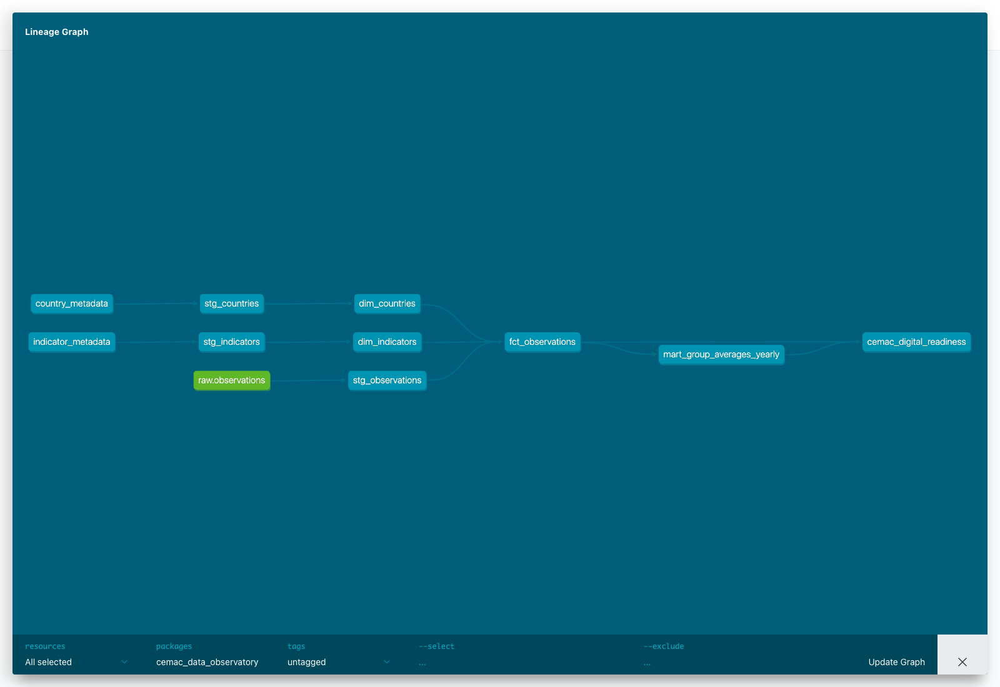

# CEMAC Data Observatory

Local warehouse and analytics stack for CEMAC indicators.

## Start the stack

Copy the example environment file if `.env` does not exist yet:

```sh
cp .env.example .env
```

Start Postgres, Metabase, and pgAdmin:

```sh
docker compose up -d
```

Default local URLs and ports:

- Postgres: `localhost:15432`
- Metabase: http://localhost:3000
- pgAdmin: http://127.0.0.1:5051

Default credentials:

- pgAdmin login: `nathangatse@outlook.com` / `admin`
- Metabase login: `nathangatse@outlook.com` / `admin`
- Postgres login: `admin` / `admin`
- Postgres database: `warehouse`

pgAdmin is preconfigured with a server named `CEMAC Data Warehouse`. If the left tree looks empty after login, refresh the browser page and expand:

`Servers > CEMAC Data Warehouse > Databases > warehouse > Schemas > raw > Tables > observations`

The Postgres container still listens on port `5432` inside Docker. The host port is `15432` to avoid conflicts with local Postgres installs or other Docker projects.

## dbt

dbt reads database credentials from `~/.dbt/profiles.yml`, not from this repo. A safe template is committed at `dbt_project/profiles.yml.example`.

Before running dbt, export the project `.env` values into your shell:

```sh
set -a
source .env
set +a
```

Then run dbt from the dbt project directory:

```sh
cd dbt_project
dbt debug
```

Generate and serve the dbt documentation site:

```sh
dbt docs generate
dbt docs serve
```

The generated lineage graph shows the raw World Bank observations and seed metadata flowing through staging into the curated mart tables.



## Stop the stack

```sh
docker compose down
```

To remove persisted database and Metabase data as well:

```sh
docker compose down -v
```

## Notes

If you paste commands into `zsh`, keep comments on a separate line. For example, run `docker compose up -d`, not `docker compose up -d # start services`; otherwise `#` can be interpreted as a service name and Docker will print `no such service: #`.

If pgAdmin shows `The CSRF token is invalid`, open http://127.0.0.1:5051 instead of `localhost`, then refresh the login page before signing in. This avoids browser cookie conflicts with other pgAdmin containers running on the same machine.
