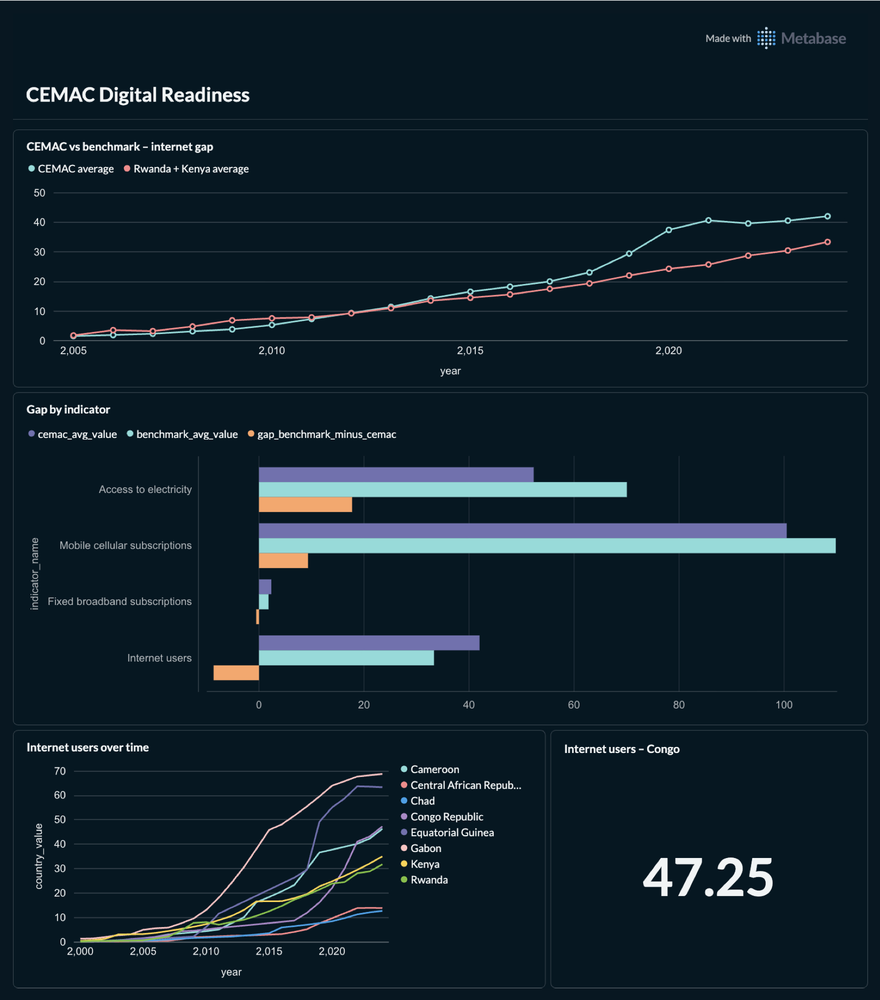
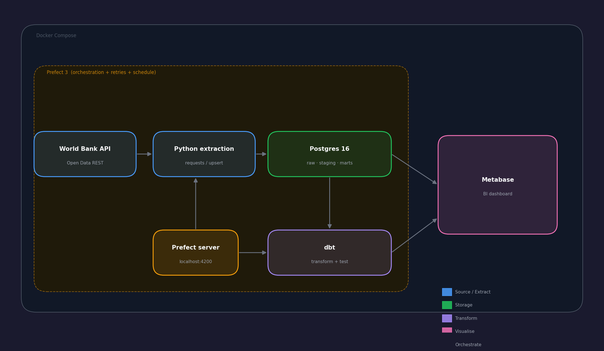
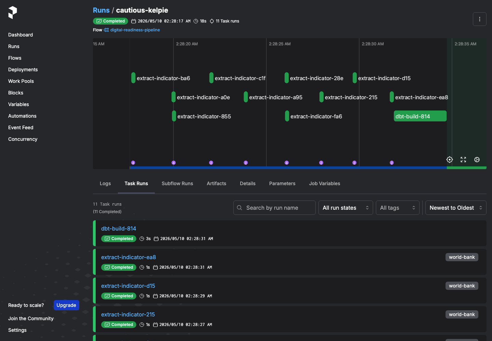

# CEMAC Digital Readiness Pipeline

A containerized data pipeline tracking digital development indicators across
the six CEMAC countries — Congo-Brazzaville, Cameroon, Gabon, Chad, Central
African Republic, Equatorial Guinea — benchmarked against African digital
leaders Rwanda and Kenya.



## What it does

Pulls 10 World Bank indicators across 8 countries and ~30 years of history
into a Postgres warehouse, transforms them with dbt into a dashboard-ready
fact model, and orchestrates the whole thing with Prefect on a weekly schedule.

The output is a Metabase dashboard answering: where does each CEMAC country
stand on digital infrastructure, and how is the gap with regional leaders
evolving?

## Architecture



| Layer | Tool | Why |
|---|---|---|
| Source | World Bank Open Data API | Free, public, well-documented |
| Extraction | Python + `requests` | Idempotent upserts via composite key |
| Storage | Postgres 16 | Industry-standard analytical database |
| Transformation | dbt | Tested, documented, lineage-tracked SQL |
| Orchestration | Prefect 3 | Retries, schedules, observability |
| Visualization | Metabase | Open-source BI on top of `marts` schema |
| Packaging | Docker Compose | One-command local stack |

## Quickstart

Requirements: Docker, Python 3.11+, ~2 GB free.

```bash
git clone <repo-url> && cd cemac-digital-readiness
cp .env.example .env          # edit if you want non-default passwords
python3.11 -m venv .venv && source .venv/bin/activate
pip install -e ".[dev]"

docker compose up -d          # postgres, metabase, prefect, pgadmin

set -a; source .env; set +a
prefect config set PREFECT_API_URL=http://localhost:4200/api
prefect concurrency-limit create world-bank 4
python -m flows.digital_readiness    # one full pipeline run (~2 min)
```

Open the dashboards:

| Service | URL |
|---|---|
| Metabase | http://localhost:3000 |
| Prefect UI | http://localhost:4200 |
| pgAdmin | http://127.0.0.1:5051 |
| Postgres (external) | `localhost:15432` |

Default credentials: `admin` / `admin` for everything (pgAdmin: `nathangatse@outlook.com` / `admin`).

For scheduled weekly runs: `python -m flows.serve` (leave running).

### Metabase first-run setup

On first visit Metabase asks you to create an admin account and connect a database.
Choose **PostgreSQL** and fill in:

| Field | Value |
|---|---|
| Host | `postgres` (Docker service name, not `localhost`) |
| Port | `5432` |
| Database name | `warehouse` |
| Username | `metabase_reader` |
| Password | `metabase_local_only` |

The `metabase_reader` role is created automatically on first container start by
[sql/init/02_metabase_reader.sql](sql/init/02_metabase_reader.sql). It has
`SELECT` access on `marts` only — it cannot write or read raw data.

> If you have an existing Postgres volume from a previous install, create the role manually:
> ```sh
> docker exec -it cdr_postgres psql -U admin -d warehouse \
>   -f /docker-entrypoint-initdb.d/02_metabase_reader.sql
> ```

## dbt

dbt reads credentials from `~/.dbt/profiles.yml`, not from this repo.
A safe template is at [dbt_project/profiles.yml.example](dbt_project/profiles.yml.example).

```bash
set -a; source .env; set +a
cd dbt_project
dbt debug        # verify connection
dbt build        # run all models + tests
dbt docs generate && dbt docs serve   # lineage graph at http://localhost:8080
```


All models have `not_null`, `unique`, and `relationships` tests. `dbt build`
runs and validates every layer in dependency order.

## Data model

- `raw.observations` — append-only landing zone, one row per (country, indicator, year)
- `staging.stg_*` — typed, cleaned views over raw
- `marts.dim_countries`, `dim_indicators` — dimension tables
- `marts.fct_observations` — denormalised fact table with recency ranking
- `marts.mart_group_averages_yearly` — CEMAC vs benchmark aggregations per indicator per year
- `marts.cemac_digital_readiness` — wide table powering the dashboard
- `marts.mart_pipeline_health` — single-row freshness and coverage card

## Running the pipeline

Manual run:

```bash
set -a; source .env; set +a
python -m flows.digital_readiness
```

Scheduled (weekly) run — leave this process running:

```bash
python -m flows.serve
```

The Prefect flow extracts all indicators in parallel, limits World Bank API
concurrency via the `world-bank` tag, then runs `dbt build` downstream.



## Design decisions

- **Postgres over a cloud warehouse** — at this scale (a few thousand rows),
  Postgres is faster, cheaper, and identical syntax for the patterns that matter.
  See [ADR-001](docs/decisions/ADR-001-postgres-over-cloud-warehouse.md).
- **Prefect over Airflow** — gentler learning curve, modern Python-native
  decorators, and `flow.serve()` removes the worker/scheduler/database setup
  burden for local development.
- **Subprocess dbt over `prefect-dbt`** — fewer dependencies, transparent
  about what's actually running. The integration package is a future swap.
- **CEMAC + Rwanda/Kenya** — deliberate. CEMAC alone is a flat regional
  comparison; benchmarks against African digital leaders create the gap
  narrative the dashboard is built around.

## What's next

- [ ] Add World Governance Indicators alongside development indicators
- [ ] DHIS2 health-system data as a second source
- [ ] dbt snapshots for historical World Bank revisions
- [ ] Containerise the worker for production-style deployment

## Stop the stack

```bash
docker compose down
```

Remove persisted data too (Postgres, Metabase):

```bash
docker compose down -v
```

## Notes

**zsh and inline comments.** Run `docker compose up -d`, not
`docker compose up -d # comment` — `zsh` can interpret `#` as a service name.

**pgAdmin CSRF error.** Open http://127.0.0.1:5051 (not `localhost`), then
refresh the login page before signing in. This avoids a cookie conflict with
other pgAdmin containers on the same machine.

## License

MIT — see [LICENSE](LICENSE).
